<a id="top"></a>

<p align="center">
  
</p>

# Hologram Apps 🛍️

<p align="center">
  <a href="../holo-os/index.html">Open the store</a> &nbsp;|&nbsp; <a href="apps/index.jsonld">Catalog</a> &nbsp;|&nbsp; <a href="apps/hub/">Hub</a> &nbsp;|&nbsp; <a href="../holo-os/README.md">Hologram OS</a> &nbsp;|&nbsp; <a href="https://discord.gg/ZwuZaNyuve">Community</a>
</p>

<p align="center">
  <a href="../holo-os/README.md"></a>
  <a href="#what-makes-them-different"></a>
  <a href="#build-your-own"></a>
  <a href="LICENSE"></a>
  <a href="https://uor.foundation/"></a>
</p>

> **The App Store for Hologram OS. Apps you own, share with a link, and verify yourself.**

A growing shelf of beautiful apps (players, games, editors, browsers, a code agent, a Linux machine) that open in any browser, run with no server, and belong to the people who make them. Open one to try it. Share it as a single link. Build your own for free.

<p align="right">(<a href="#top">back to top</a>)</p>

## Open one

Every app here is one self-contained package. There is nothing to install and nothing to sign up for. Open it from the store, or paste its link, and it boots in your browser. Close the tab and it leaves nothing behind unless you asked it to.

Today the shelf holds 50+ apps, including:

| | | |
|---|---|---|
| **Holo Code**: an AI coding partner that runs on your machine | **Holo Tube**: watch video, gapless | **Holo Music**: your library, your way |
| **Holo Trade**: a live markets terminal, no keys held | **Holo Git**: a forge with no server | **Holo Linux**: a real Linux box in a tab |
| **Holo Browser**: the open web, no middleman | **Holo Files**: your files stay yours | **Holo Hub**: the store itself, as an app |

<p align="right">(<a href="#top">back to top</a>)</p>

## What makes them different

- **100% serverless.** No backend to rent, deploy, or keep alive. The app is the whole thing.
- **Owned by the creator.** You make it, you hold it. No platform sits between you and your work.
- **Seamless to build, run, and share.** Write it like a normal web page. Run it by opening it. Share it as one link.
- **Free to build, run, and share.** No fees, no gatekeeper, no review queue.
- **Built-in money, one way.** Charge for an app or sell inside it through a single, shared payment interface. No separate billing setup.
- **Runs anywhere.** The same app works from a phone to a desktop, from the edge to the cloud, unchanged.
- **Private and decentralized.** Your data stays on your device unless you choose to send it. There is no central server to watch you.
- **Your network is yours.** The people who use your app are your audience, not a platform's. You keep the relationship.
- **Instantly interoperable.** Every Hologram app speaks the same language, so they read and build on each other out of the box.
- **Delightful, and it just works.** Fast, polished, and consistent. Beauty is the baseline, not an upgrade.

<p align="right">(<a href="#top">back to top</a>)</p>

## You don't trust it. You verify it.

An app's name comes from its own contents. Change one byte and the name changes, so an app can prove it is exactly what it claims to be, and your device checks that proof before running a single line. Nothing to take on faith. If the proof fails, it refuses to run.

This is why an app can travel as a plain link and still be safe: wherever it lands, it re-proves itself.

<p align="right">(<a href="#top">back to top</a>)</p>

## Build your own

Apps are ordinary HTML, CSS, and JavaScript. No framework to learn, no build step, no server to stand up. One command scaffolds a complete app that already looks at home in the store:

```sh
node ../holo-os/tools/create-holospace.mjs my-app \
  --name "My App" --summary "What it does" --accent "#22c55e"
```

You get a working app, an icon, a manifest, and a sealed package. Theme, layout, permissions, and payments are already wired in by the OS, so you write only what is yours. When it is ready, share the link. That is the whole release.

<p align="right">(<a href="#top">back to top</a>)</p>

## How it fits together

Each app lives in `apps/<id>/`:

- `holospace.json` defines the app: name, icon, what it's allowed to touch.
- `holospace.lock.json` is the sealed package: every file pinned to its verifiable name.
- `index.html` + the app's own code.

`apps/index.jsonld` is the catalog, a machine-readable listing of the whole store. [Hologram OS](../holo-os/README.md) supplies the frame and the shared runtime; each app brings only itself.

<p align="right">(<a href="#top">back to top</a>)</p>

## License

Released under the MIT License. See [LICENSE](LICENSE) for details.

---

<p align="center"><i>An app you can hold in one hand and hand to anyone.<br/>Open it once and you will say it yourself: this is mine.</i></p>

<p align="right">(<a href="#top">back to top</a>)</p>
